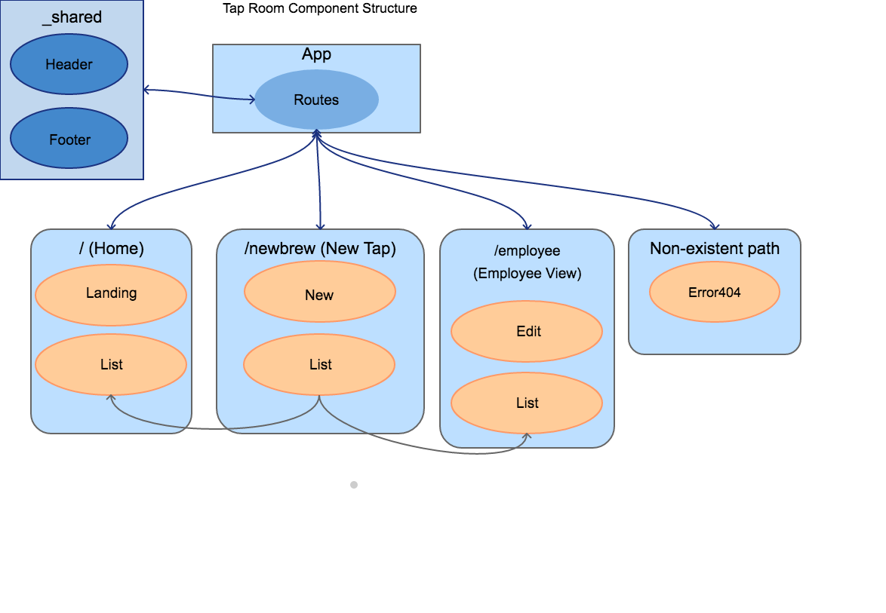

# Friday Independent Project
## By HanleyJames

To Do:
  1. ~~Outline the Component and routing structure~~
  2. Write static lists to pass to list component
  3. Include section with brief answers to the prompts:
    + Add notes section for documenting issues, and questions. Commit these notes by themselves.
    + In the description of the project, include thoughts on differences in development process between Angular and React.

Objectives:
+ Development environment is fully-functional, including Babel transpiling, Webpack module bundling, a development server with hot module replacement, and linting.
+ Components are used to create modular UI elements.
+ propTypes define data types and shapes for all component props.
+ Application successfully uses client-side routing via the React-Router library to create appearance of multiple pages.
+ Styles are successfully added using CSS objects.
+ Project was submitted by the Friday deadline.
+ Project demonstrates an understanding of this week's concepts. If prompted, you can discuss your code with an instructor using the correct terminology.

| Flow Chart|
|-----------|
||